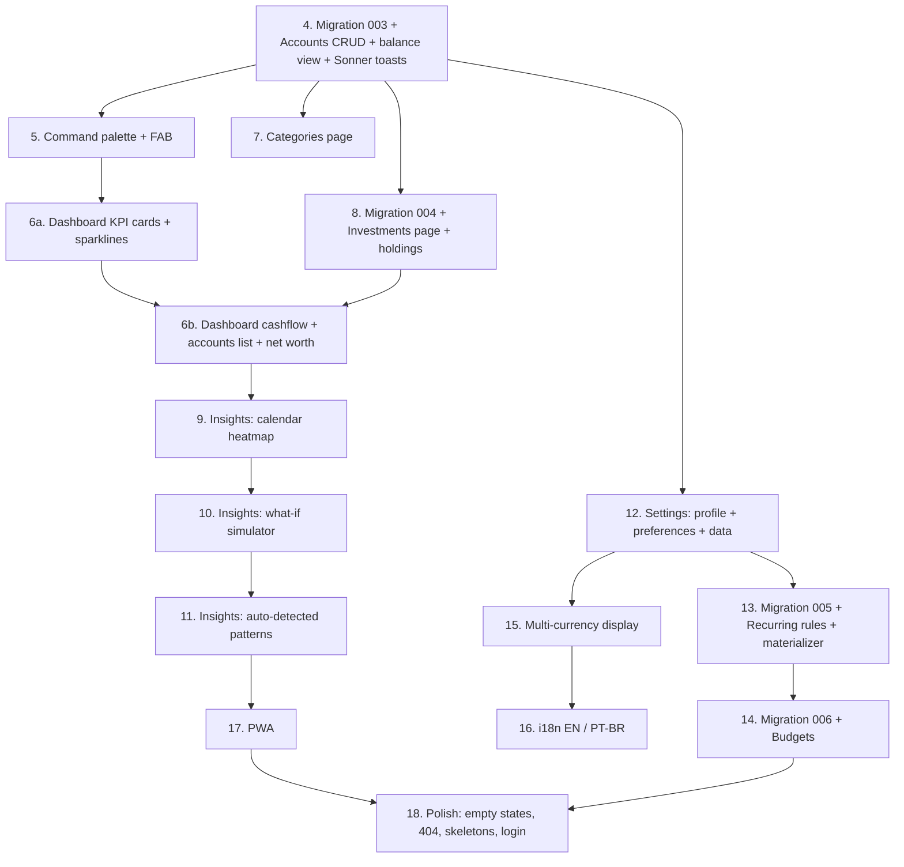

# OmniFlow — full roadmap from step 4 through MVP-complete

> **Source of truth.** This file is the canonical implementation plan. Future sessions must read it before starting any step. The condensed checklist in `CLAUDE.md` `## Roadmap` is the index, not the plan. If reality diverges from the plan during implementation, edit this file in the same commit as the code change — never let plan and code drift.

## Context

Steps 1–3 shipped the scaffold, Supabase auth + RLS schema, and full transactions CRUD (form, table, filter chips, edit, soft-delete, CSV export). What's left is to turn the prototype's full surface — Dashboard with KPIs and charts, Investments / Categories / Insights / Settings, command palette, FAB, recurring, budgets, multi-currency, i18n, PWA — into shipped feature pages.

The codebase is small, internally consistent, and already has working patterns for query hooks (`src/features/{accounts,categories,transactions}/queries.ts`), optimistic mutations (`src/features/transactions/mutations.ts`), URL-bound filter state (`src/features/transactions/filter-chips.tsx`), modal store (`src/stores/modal-store.ts`), CSV export (`src/lib/csv.ts`), and money parsing/formatting (`src/lib/format.ts`). Every later step copies these patterns rather than inventing new ones.

The plan re-orders the work behind three real constraints found in the code, not in the draft:

- **Migration 002 has been applied** to the hosted project (done earlier via `supabase db push` once the CLI was wired). All future migrations apply the same way.
- **No toast library exists** (`grep` for `sonner|toast` returns nothing; `package.json` confirms). CLAUDE.md's "toasts for confirmation" principle is aspirational right now. We add Sonner once, in step 4, and retrofit existing transaction mutations.
- **No FAB exists**, despite the CLAUDE.md "Floating action button on every authenticated route" line. The prototype `app.jsx` has one (`prototype/src/app.jsx:163`); we add it in step 5 alongside the command palette since they're the same keyboard-first push.

The draft plan also treats `balance_cents` on `accounts` as something to potentially keep for back-compat. It's never written by app code — drop it cleanly in migration 003 and remove the field from `AccountSchema` in the same commit.

## Architectural decisions to lock

These are the calls implementers shouldn't re-litigate per step.

1. **Account balance is derived, not cached.** Migration 003 adds `accounts.opening_balance_cents bigint not null default 0`, drops `accounts.balance_cents`, and creates a SQL view `account_balances_v(account_id, balance_cents)` = `opening + sum of signed transaction amounts`. Sign rule: `expense` and outgoing-`transfer` rows subtract; `earning`, `investment`, and incoming-`transfer` rows add (investment treated as a movement *into* a brokerage account, mirroring the prototype). Every dashboard / accounts / investments surface reads through `account_balances_v` (or a `useAccountBalances()` hook backed by it) — never a cached column.

2. **Transfers are a fourth `type` with a destination link.** Migration 003 extends the `transactions.type` check to include `'transfer'` and adds nullable `transfer_account_id uuid references accounts(id) on delete restrict`, with a check constraint `(type = 'transfer') = (transfer_account_id is not null)`. One row per transfer; `account_id` is the source, `transfer_account_id` is the destination. Cleaner than two linked rows, idempotent under undo.

3. **Recharts for charts.** Confirmed. Token-friendly (HSL CSS vars via `currentColor`), small enough to ship, supports `tickFormatter` for tabular numerals. No fallback library budgeted.

4. **Recurring idempotency = partial unique index, not application-level dedupe.** Migration 005 adds `transactions.rule_id uuid` (nullable) and `transactions.period_start date` (nullable) plus `create unique index transactions_rule_period_uniq on transactions(rule_id, period_start) where rule_id is not null`. The client materializer can re-run safely.

5. **Currency-of-record stays per-row** (already on `transactions.currency` since 001). FX conversion is display-time only, deferred to step 15. No historical rewrites.

6. **Toasts via Sonner.** Added once in step 4. Every mutation's `onError` calls `toast.error(...)`; create/edit/delete success calls `toast.success(...)`. Existing tx mutations get retrofitted in the same commit so the pattern is consistent before it's copied.

7. **Accounts management lives under Settings**, not a top-level route. Sidebar is already busy; account editing is rare. Settings becomes tabbed (Profile / Accounts / Preferences / Data) starting in step 4 to leave room for steps 12+.

## Sequencing



The diagram shows what blocks what. Step 4 is the keystone — every chart, every dashboard card, and the investments holdings panel reads `account_balances_v`. Steps 7, 8, and 12 fan out from it independently, so they can be parallelized across sessions if desired.

## Steps

### Step 4 — Migration 003, Accounts CRUD, Sonner toasts

**Why first.** Unblocks every later step that reads balances, and lands the toast system before more mutations are written.

- `supabase/migrations/003_accounts_balance_transfers.sql`:
  - `alter table accounts add column opening_balance_cents bigint not null default 0;`
  - `alter table accounts drop column balance_cents;`
  - Extend `transactions.type` check to include `'transfer'`. Add `transfer_account_id uuid references accounts(id) on delete restrict`. Add check `(type = 'transfer') = (transfer_account_id is not null)`. Add check `(type = 'transfer') => (transfer_account_id <> account_id)`.
  - `create or replace view account_balances_v as ...` joining accounts with summed signed transactions (excluding `deleted_at is not null`). One row per account, even if zero transactions. Grant select to `authenticated`. RLS handled by underlying tables.
  - Add `archived_at timestamptz` to accounts (soft-delete; preserves transaction integrity).
- Run `supabase db push` to apply 003.
- Edit `src/features/accounts/schemas.ts`: replace `balance_cents` with `opening_balance_cents`.
- New `src/features/accounts/mutations.ts`: `useCreateAccount`, `useUpdateAccount`, `useArchiveAccount`. Copy the `onMutate`/`onError`/`onSettled` shape from `src/features/transactions/mutations.ts:27-86`.
- New `src/features/accounts/balances-queries.ts`: `useAccountBalances()` returning `Map<accountId, cents>` from `account_balances_v`. Cache key `["account-balances", userId]`. Invalidate when transactions or accounts mutate.
- New `src/features/accounts/account-form.tsx`: react-hook-form + zod, fields name / type (existing enum) / short_name / last4 / color / icon / opening_balance / currency.
- New `src/features/settings/settings-page.tsx` rewrite: tabs (Profile, Accounts, Preferences, Data) using a simple radio-tab pattern; render `<AccountsPanel />` under Accounts (list + add + edit dialog + archive confirm).
- Install `sonner`. Add `<Toaster richColors closeButton position="bottom-right" />` to `src/app/providers.tsx` near the QueryClientProvider. Retrofit `src/features/transactions/mutations.ts` to call `toast.success`/`toast.error`. New mutations in this PR use the same pattern.
- Transfer support in transaction form: extend `TRANSACTION_TYPES` (likely keep separate or fold into existing form's type segmented control). Show a destination-account picker only when type=transfer; hide category picker.

### Step 5 — Command palette + FAB

**Why now.** Cross-cutting registration; if it lands after the feature pages, every page registers actions retroactively. Also lands the FAB the codebase has been missing.

- Install `cmdk` (shadcn `command` component wraps it; add via the canonical shadcn snippet under `src/components/ui/command.tsx`).
- New `src/features/command-palette/{provider.tsx, registry.ts, palette-dialog.tsx, hooks.ts}`. `registry.ts` is a Zustand store of `{id, label, group, hint?, run: () => void}` so feature pages can call `useRegisterCommands([...])` on mount.
- Wire the topbar Search button (`src/components/layout/topbar.tsx:50-56`) to open the palette. Global `⌘K` / `Ctrl+K` listener in `src/components/keyboard-shortcuts.tsx`. Initial commands: navigate to each route (one per `STATIC_WORKSPACE_NAV` entry in `src/components/layout/sidebar.tsx:29-35`), New transaction, Toggle theme, Sign out.
- New `src/components/layout/fab.tsx`: 56px circular brand-colored button, fixed `bottom-6 right-6`, opens the new-transaction dialog. Render it inside `AdminLayout` so it appears on every authenticated route.
- Footer hints in palette: ↑↓ navigate, ↵ select, esc close.

### Step 6a — Dashboard KPI cards + sparklines

- Install `recharts`.
- New `src/features/dashboard/{kpi-card.tsx, sparkline.tsx, time-range-chips.tsx}`.
- Replace the placeholder text in `src/features/dashboard/dashboard-page.tsx:93-95` with 4 KPI cards: Net worth, Income (range), Spending (range), Invested (range). Big number in Space Grotesk + `tabular-nums`, MoM delta, inline 7-point sparkline. Net worth reads `useAccountBalances()` from step 4.
- Time-range chips (7d / 30d / MTD / YTD) — reuse the `useSearchParams` pattern from `src/features/transactions/filter-chips.tsx:24-43`. Key: `range`.
- Greeting line: "Good {morning|afternoon|evening}, {first part of email before @}" computed from `Date#getHours()` and `useAuth()`.

### Step 6b — Dashboard cashflow + accounts + net worth

Depends on step 4 (balances) and step 6a (KPI shell + range chips).

- `src/features/dashboard/cashflow-chart.tsx`: 12-week dual-bar income vs expense (Recharts `BarChart` with two `<Bar>` series). Aggregate by ISO week using `date-fns/startOfISOWeek`. Tooltip uses `fmtMoney`.
- `src/features/dashboard/top-spending.tsx`: top 5 categories MTD, horizontal bar list normalized to max — pure HTML, no Recharts needed.
- `src/features/dashboard/accounts-list.tsx`: per-account row with balance from `useAccountBalances()`, total liquid sum at the top.
- `src/features/dashboard/net-worth-chart.tsx`: 12-month line with gradient fill (Recharts `Area`). Compute monthly snapshots client-side from transactions + opening balances. Segmented selector 3M / 6M / 1Y / All — URL-bound `nw=` param.
- Replace the dashboard page's recent-list block with the new layout; keep the Recent transactions card at the bottom.

### Step 7 — Categories page

- New `src/features/categories/{categories-page.tsx (rewrite), category-card.tsx, category-form.tsx, mutations.ts}`.
- Card grid: colored icon square, name, type chip, transaction count (computed from `useTransactions`), 3-dot menu.
- New / edit / delete dialogs. Delete blocks if count > 0; edit allows changing type, color, icon, name (existing transactions keep their old `category_id`, no cascading rewrites — the column already does `on delete set null`).
- Sort: type then alphabetical. Drag-to-reorder deferred.

### Step 8 — Migration 004 + Investments page

- `supabase/migrations/004_holdings.sql`:
  - `create table holdings (id uuid pk, user_id, account_id references accounts, ticker, name, shares numeric(20,6), avg_cost_cents bigint, current_price_cents bigint, currency, notes text, timestamps)`. RLS policies in same migration.
  - `alter table transactions add column holding_id uuid references holdings(id) on delete set null`.
- New `src/features/investments/{schemas.ts, queries.ts, mutations.ts, holdings-table.tsx, holding-form.tsx, investments-page.tsx (rewrite)}`.
- 4 KPI cards: Portfolio value (sum of `shares * current_price_cents`), All-time gain $/% (vs `shares * avg_cost_cents`), Cost basis, MTD contributions (sum of transactions where `type='investment'` MTD).
- Holdings table with click-to-edit. "Update price" inline action — manual entry, no quotes API in v1.
- "Log buy/sell" opens the existing transaction dialog pre-filtered to type=investment with `holding_id` linked. Adjust `useCreateTransaction` to pass through `holding_id`.

### Step 9 — Insights: calendar heatmap

UI-only over existing transactions data; no migration.

- New `src/features/insights/{insights-page.tsx (rewrite), calendar-heatmap.tsx, day-breakdown.tsx, month-picker.tsx}`.
- Month picker at top; 7×6 grid. Each cell shows day number + up to 2 abbreviated rows (income green, expense red). Today gets a brand border.
- Click a day → right column lists that day's transactions in dense style matching `prototype/src/dashboard.jsx`'s recent-list.

### Step 10 — Insights: what-if simulator

- New `src/features/insights/simulator.tsx`. Inputs: monthly salary, side income, fixed expenses, variable expenses. Sliders (shadcn `slider` — add via canonical shadcn snippet) for % invested (0–100) and expected annual return (0–20). Time selector 6m / 12m / 24m / 5y.
- Pre-fill inputs from last-30-days averages over `useTransactions`.
- Outputs: surplus/mo, invested/mo, total in N months, projected net worth = future value of monthly contributions: `FV = PMT * ((1 + r/12)^n - 1) / (r/12)`. Pure client math.

### Step 11 — Insights: auto-detected patterns

- New `src/features/insights/patterns/`: each detector is a pure function `(transactions, accounts, categories) => Insight | null`.
- Initial set: account concentration (>X% spend on one account), subscription drift (Subscriptions category trending up MoM), idle voucher balance (voucher account untouched 60d+), category cap warning (>30% of spend), savings-rate trend.
- Render as cards in `insights-cards.tsx` with tone (warn / good / info), icon, title, body, optional CTA link.

### Step 12 — Settings: profile + preferences + data

The Accounts tab already exists from step 4. This step builds the other three.

- Profile tab: change email, change password (Supabase requires re-auth — surface a re-auth dialog), delete account (Supabase Edge Function `delete-account` invoked from client; RLS cascades the rest).
- Preferences tab: currency (BRL / USD / EUR — display-only until step 15), language (EN / PT-BR — stored as preference, no i18n yet). Both extend `useUIStore` in `src/stores/ui-store.ts:6-13`.
- Data tab: CSV import (re-uses `lib/csv.ts` reader; new `src/lib/csv-import.ts` for parsing + column mapping UI), full data export as JSON (transactions + accounts + categories + holdings).

### Step 13 — Migration 005 + Recurring rules

- `supabase/migrations/005_recurring_rules.sql`:
  - `create table recurring_rules (id, user_id, name, type, amount_cents, account_id, category_id, cadence text check in ('daily','weekly','monthly','yearly'), anchor_date, next_run_date, end_date nullable, active bool default true, timestamps)`. RLS in same file.
  - `alter table transactions add column rule_id uuid references recurring_rules(id) on delete set null`.
  - `alter table transactions add column period_start date`.
  - `create unique index transactions_rule_period_uniq on transactions(rule_id, period_start) where rule_id is not null`.
- New `src/features/recurring/{rules-page.tsx, rule-form.tsx, mutations.ts, queries.ts, materializer.ts}`. Add to sidebar under Workspace.
- `materializer.ts`: runs in `useEffect` on app mount; for each active rule, walks from `next_run_date` to today and inserts a transaction with `(rule_id, period_start)` for each missing period. Idempotent via the unique index — re-runs are safe. Updates `next_run_date` after each successful insert batch.
- "Recurring" badge in the transactions table when `rule_id is not null` — extend `src/features/transactions/transactions-table.tsx` to render a small chip.

### Step 14 — Migration 006 + Budgets

- `supabase/migrations/006_budgets.sql`: `create table budgets (id, user_id, category_id, monthly_cents, period_start date, timestamps)`. RLS in same file. Unique on `(category_id, period_start)`.
- New `src/features/budgets/{budget-form.tsx, budget-progress.tsx, mutations.ts, queries.ts}`.
- Categories page (step 7) gets a per-card progress bar (current month spend / budget). Edit budget inline from the card menu.
- Insights detector: "Groceries 110% of budget" — wires into step 11's pattern engine.
- Optional: pre-create warning toast on transaction create that pushes a budget over (`useCreateTransaction.onSuccess` checks `useBudgets()` snapshot).

### Step 15 — Multi-currency display

- New `src/lib/fx.ts`. Rates table either:
  - hardcoded JSON (`src/lib/fx-rates.json`) refreshed manually, OR
  - `fx_rates` table (migration 007 if we go DB route — decision deferred to implementation).
- Account in non-default currency renders both native and converted-to-preferred values.
- Dashboard KPIs always sum in user-preferred currency at latest rate.
- Per-transaction display stays in source currency (already correct).
- Extend `fmtMoney` in `src/lib/format.ts` to take an explicit currency arg (already partially supports it).

### Step 16 — i18n EN / PT-BR

- Install `react-i18next` + `i18next`. New `src/i18n/{config.ts, en/common.json, pt-BR/common.json}`.
- Extract all app-controlled strings — CLAUDE.md's English-by-default pass means a clean baseline. Use `t('namespace.key')` with stable keys; never auto-extract from English at runtime.
- Language toggle in the Preferences tab (step 12) drives `i18n.changeLanguage`.
- User-typed data (transaction descriptions, custom names) untouched.

### Step 17 — PWA

- Install `vite-plugin-pwa`. Configure auto-update.
- `public/manifest.webmanifest`: brand color `#FACC15`, Volt as icon (existing `public/volt.svg`), display=standalone.
- Service worker: cache app shell + last fetched query results for offline read (`@vite-pwa`'s NetworkFirst).
- Install prompt UX in Settings → Preferences.
- Capacitor wrapper stays deferred per CLAUDE.md.

### Step 18 — Polish pass

- Volt empty states on every feature page: tx page (already has one — generalize), categories, holdings, insights cards, recurring, budgets.
- 404 page (`src/features/not-found/not-found-page.tsx`) redesign with Volt + clever copy.
- Skeletons matching final layout shape on every async surface (CLAUDE.md: skeletons not spinners). Replace existing "Loading…" text in `dashboard-page.tsx:43`, `transactions-page.tsx:83`, etc.
- Login screen redesign matching `prototype/src/app.jsx` login: full-page radial gradient, oversized Volt, signup toggle polish.
- `toast.success("Welcome back")` on login.

## Critical files

**Created:**

```
supabase/migrations/003_accounts_balance_transfers.sql
supabase/migrations/004_holdings.sql
supabase/migrations/005_recurring_rules.sql
supabase/migrations/006_budgets.sql
src/components/ui/command.tsx                 # shadcn cmdk wrapper
src/components/ui/sonner.tsx                  # shadcn sonner wrapper (Toaster)
src/components/ui/slider.tsx                  # for simulator + budgets (step 10/14)
src/components/ui/progress.tsx                # for budgets (step 14)
src/components/ui/tabs.tsx                    # for settings tabs (step 4/12)
src/components/layout/fab.tsx                 # step 5
src/features/accounts/{mutations.ts, balances-queries.ts, account-form.tsx}
src/features/command-palette/{provider.tsx, registry.ts, palette-dialog.tsx, hooks.ts}
src/features/dashboard/{kpi-card.tsx, sparkline.tsx, time-range-chips.tsx, cashflow-chart.tsx, top-spending.tsx, accounts-list.tsx, net-worth-chart.tsx}
src/features/categories/{category-card.tsx, category-form.tsx, mutations.ts}
src/features/investments/{schemas.ts, queries.ts, mutations.ts, holdings-table.tsx, holding-form.tsx}
src/features/insights/{calendar-heatmap.tsx, day-breakdown.tsx, month-picker.tsx, simulator.tsx, patterns/*.ts, insights-cards.tsx}
src/features/settings/{profile-section.tsx, accounts-section.tsx, preferences-section.tsx, data-section.tsx}
src/features/recurring/{rules-page.tsx, rule-form.tsx, mutations.ts, queries.ts, materializer.ts}
src/features/budgets/{budget-form.tsx, budget-progress.tsx, mutations.ts, queries.ts}
src/lib/{fx.ts, csv-import.ts}
src/i18n/{config.ts, en/common.json, pt-BR/common.json}
public/manifest.webmanifest
```

**Modified repeatedly:**

```
CLAUDE.md                               # ## Status updated each step (same-commit rule)
src/app/router.tsx                      # add /recurring (step 13)
src/app/providers.tsx                   # add <Toaster /> (step 4), i18n provider (step 16)
src/components/layout/sidebar.tsx       # add badges, /recurring entry
src/components/layout/topbar.tsx        # wire Search button to palette (step 5)
src/components/keyboard-shortcuts.tsx   # add ⌘K (step 5)
src/stores/ui-store.ts                  # add currency, language preferences (step 12)
src/stores/modal-store.ts               # extend for new dialogs as needed
src/features/accounts/schemas.ts        # drop balance_cents, add opening_balance_cents (step 4)
src/features/transactions/{schemas.ts, transaction-form.tsx, mutations.ts, transactions-table.tsx}
                                        # add transfer type (step 4), holding_id (step 8), rule_id badge (step 13)
src/lib/format.ts                       # currency arg + FX integration (step 15)
package.json                            # sonner, cmdk, recharts, vite-plugin-pwa, react-i18next
```

## Reused from existing code

- `parseAmountToCents`, `fmtMoney`, `fmtDate`, `parseISODate`, `toISODate` (`src/lib/format.ts`) — every form and chart.
- shadcn primitives in `src/components/ui/` — already covers button, card, dialog, popover, select, alert-dialog, dropdown-menu, calendar, date-picker, input, label, separator. Add command, sonner, slider, progress, tabs only.
- Optimistic mutation pattern (`src/features/transactions/mutations.ts:27-86`) — copy verbatim into every new feature's `mutations.ts`.
- URL-bound filter pattern (`src/features/transactions/filter-chips.tsx:24-43`) — reuse for time-range chips, month picker, net-worth range.
- Modal store pattern (`src/stores/modal-store.ts`) — extend, don't fork.
- Sidebar badge pattern (`src/components/layout/sidebar.tsx:48-55`, dynamic badges via filter on `useTransactions`) — reuse for budget breach count, recurring rules count, etc.
- CSV download helper `downloadCsv` in `src/lib/csv.ts:28-38` — extend with `csv-import.ts`.
- Existing transaction dialog (`src/features/transactions/transaction-dialog.tsx`) is the entry for buy/sell logging in step 8 (don't fork a "log holding" dialog).

## Out of scope for now (deferred indefinitely)

- Capacitor native shell (mobile/desktop wrappers) — CLAUDE.md says later phase.
- Live broker quote feeds, real-time bank linking (Plaid / Pluggy / Belvo).
- Receipt and attachment uploads.
- Tax-lot tracking and capital-gains reporting for investments.
- Multi-user / sharing / household accounts (single-user app per CLAUDE.md).
- Notifications system (the topbar `<Bell>` is decorative until there's a real source).

## Verification

Each step ships green typecheck (`pnpm typecheck`), green build (`pnpm build`), and a smoke test in the browser against the hosted Supabase project before commit. Specific verifications:

- **Step 4** — `supabase db push` applies 003 cleanly. Create a second account with opening balance R$ 1000; transfer R$ 200 from Checking; both balances move correctly via `account_balances_v`. Soft-delete a transaction; balances recover. Toast appears on every mutation.
- **Step 5** — `⌘K` opens palette from any route; arrow keys navigate; enter triggers; esc closes. FAB visible on every authenticated route, opens new-tx dialog.
- **Step 6a** — KPI MoM delta correct on a manually crafted dataset (one month doubled). Time-range chips bookmark via URL.
- **Step 6b** — Cashflow chart matches a hand-summed week. Net-worth line matches sum of derived balances at month-end.
- **Step 7** — Count badge equals active count per category. Deleting a non-empty category is blocked.
- **Step 8** — Buy 5 VTSAX via tx dialog → holding shares + cost basis update; portfolio KPI reflects new value.
- **Step 9** — Calendar shows correct daily aggregates; click empty day → empty-state.
- **Step 10** — Simulator pre-fills from real averages; FV math sanity-checked vs hand calc (`PMT=1000, r=0.06, n=12 → ~12,335`).
- **Step 11** — At least 3 detectors fire on a 30-day dataset.
- **Step 12** — Email change + re-login works. CSV import of 100 rows creates 100 transactions with no dupes.
- **Step 13** — Define a monthly rule with anchor 3 months ago; reload → 3 transactions backfilled with distinct `period_start`. Reload again → no duplicates (unique index works).
- **Step 14** — Set budget below current spend; categories page shows red progress; insights surfaces a breach card.
- **Step 15** — Add a USD account with a USD transaction; KPIs sum in BRL using current rate; flip preference to USD; sums recalc.
- **Step 16** — Toggle PT-BR; every label flips. User-typed descriptions unchanged.
- **Step 17** — Install as PWA in Chrome; open offline; cached transactions render.
- **Step 18** — Every page has Volt empty state where applicable; 404 has Volt; every async surface has a layout-matching skeleton.

## Maintenance contract

- **Read this file first** before implementing any step. The condensed Roadmap in `CLAUDE.md` is just the index.
- **Same-commit edits.** If a step needs to deviate (new constraint discovered, scope change, ordering swap), edit this file in the same commit as the implementation. Plan and code never drift.
- **Roadmap checkbox flip.** After completing a step, flip its checkbox in `CLAUDE.md` `## Roadmap` from `[ ]` to `[x]` (or `[~]` if landing in chunks) in the same commit. The `## Status` block gets a new "Step N — done." line.
- **Detail belongs here.** Roadmap lines stay one-liners. Bigger changes — new steps, dropped steps, reordering — get reflected in both files.
